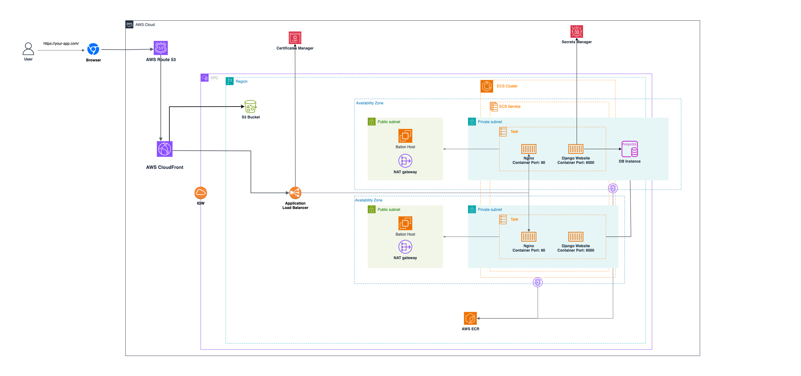
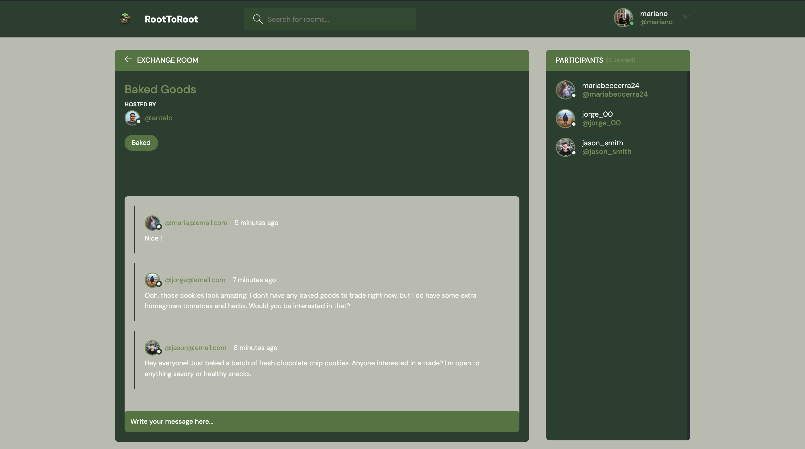

# RootToRoot - An eco-friendly goods exchange platform


Swap, don't shop! Find new treasures and give your unwanted items a second life. RootToRoot is a social experiment where people can exchange their goods instead of throwing them away or donating them.

## Table of Content

- [Deployment](#Deployment)
- [Solutions Architecture](#SolutionsArchitecture)
- [Tech Stack](#TechStack)
- [Local Debuggin](#local-debugging)
- [App Preview](#AppPreview)

## Cloud Infrastucture


## Deployment

### Variables Configuration 
First, configure the following environment variables:

- AWS_ACCESS_KEY:Your AWS Access Key with necessary permissions attached
- AWS_SECRET_KEY:Your AWS Secret Key with necessary permissions attached
- AWS_ACCOUNT_ID:Your account ID (i.e. 5254-7698-8654)
- AWS_REGION: AWS Region to deploy your resources (i.e. "sa-east-1")


1. Create ECR Repository and upload docker images 
``` bash 
bash ./scripts/deploy_ecr.sh
```

2. Build network and compute resources
``` bash 
bash ./scripts/deploy_infrastructure.sh
```

## Main Tech Stack

### Web Server

- [Django](https://www.djangoproject.com/) - A high-level Python web framework that encourages rapid development and clean, pragmatic design;
- [Gunicorn](https://gunicorn.org/) - A Python WSGI HTTP server for UNIX, known for its performance and ease of use;
- [Nginx](https://www.nginx.com/) - A high-performance HTTP and reverse proxy server, commonly used for serving static files and load balancing;
- [PostgreSQL](https://www.postgresql.org/) - A powerful, open-source object-relational database system known for its reliability and data integrity features.

### AWS Services

- [Amazon ECS (Elastic Container Service)](https://aws.amazon.com/ecs/) - A fully managed container orchestration service that simplifies deploying, managing, and scaling containerized applications;
- [Amazon RDS (Relational Database Service)](https://aws.amazon.com/rds/) - A managed service that makes it easy to set up, operate, and scale relational databases in the cloud;
- [Amazon Route 53](https://aws.amazon.com/route53/) - A highly available and scalable cloud Domain Name System (DNS) web service;
- [Amazon CloudFront](https://aws.amazon.com/cloudfront/) - A content delivery network (CDN) service that accelerates delivery of websites, APIs, video content, and other web assets.


## Local Debuggin 
Application was debuuged withe the following versions: 
- Environment == MacOS Sonoma 14.4.1
- Python Version == 3.8.19 
- Docker version == 26.0.0 
- Docker-compose version == 2.26.1 

Run the following commands: 
```bash 
docker-compose build 
docker-compose up
```

Application will be running on port 80 (nginx port)
[!NOTE]  
You can still access through port 8000 but no style will be fetched.

## Website GUI

<table width="100%"> 
<tr>
<td width="50%">      
&nbsp; 
<br>
<p align="center">
  HOME PAGE
</p>

</td> 
<td width="50%">
<br>
<p align="center">
  ROOM EXCHANGE VIEW
</p>
  
</td>
</table>


